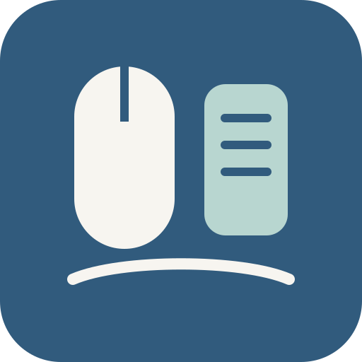
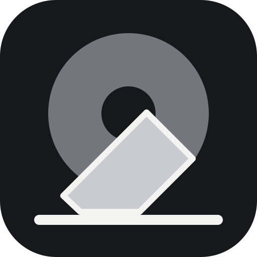
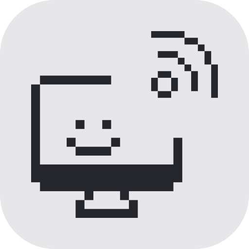
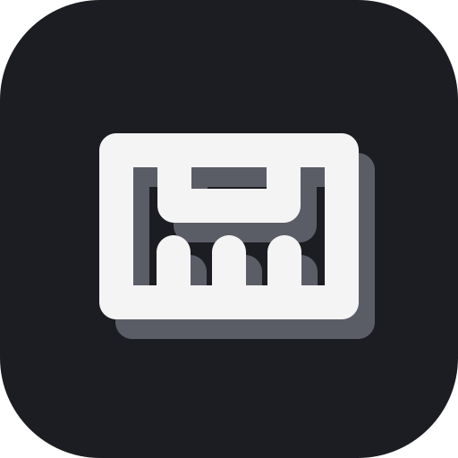
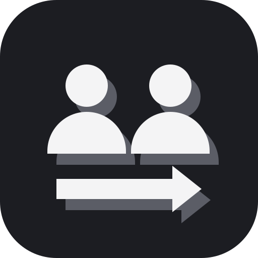
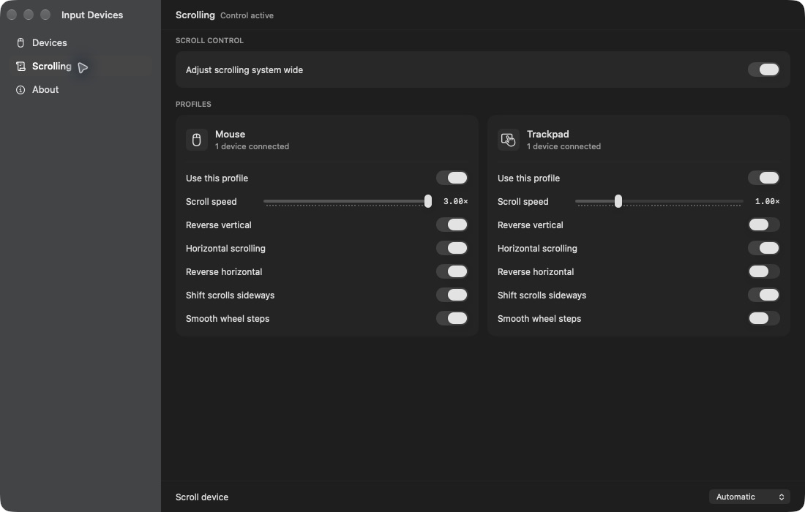
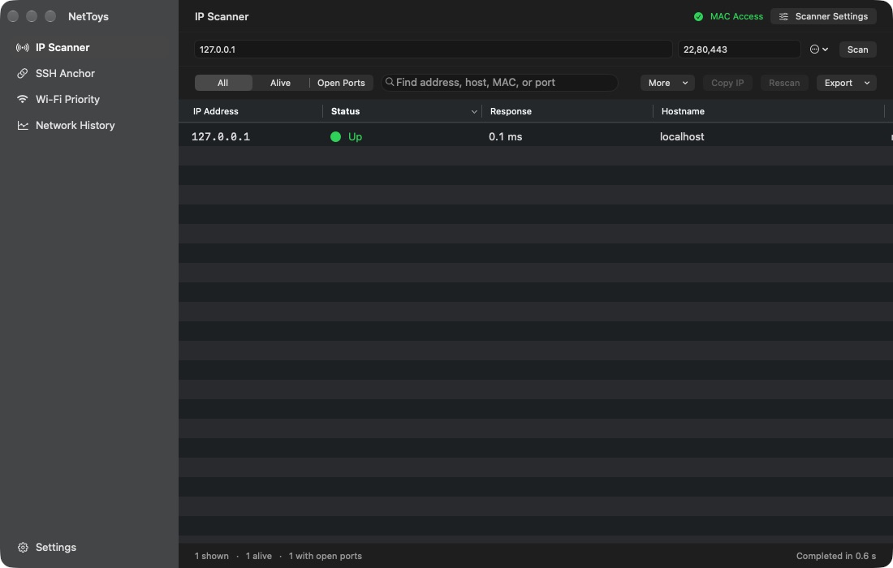
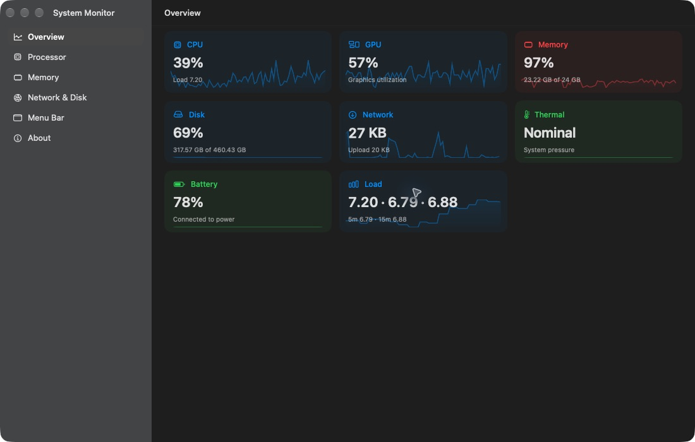

<p align="center">
  
</p>

<h1 align="center">MacPowerToys</h1>

<p align="center">
  <strong>Small macOS utilities. One native home.</strong><br>
  Capture text, tune input, monitor your Mac, clean storage, and sync files<br>
  without installing a pile of unrelated menu bar apps.
</p>

<p align="center">
  <a href="https://github.com/surajmandalcell/macpowertoys/releases/latest"></a>
  
  
  <a href="LICENSE"></a>
</p>

<p align="center">
  <a href="https://github.com/surajmandalcell/macpowertoys/releases/latest"><b>Download for macOS</b></a>
  &nbsp;&nbsp;·&nbsp;&nbsp;
  <a href="#build-from-source">Build from source</a>
</p>

<p align="center">
  
</p>

<table>
  <tr>
    <td width="33%" align="center"><b>Native</b><br><sub>SwiftUI, AppKit, system materials, and proper Mac windows.</sub></td>
    <td width="33%" align="center"><b>Private</b><br><sub>No first-party analytics, advertising SDK, or telemetry service.</sub></td>
    <td width="33%" align="center"><b>Consistent</b><br><sub>One launcher, remembered windows, and keyboard-first controls.</sub></td>
  </tr>
</table>

## Focused tools

| | Tool | What it does |
|:--:|---|---|
|  | **Ruler** | Measure the screen with movable, resizable rulers in pixels, millimeters, or inches. |
|  | **Awake** | Keep the Mac or display awake by duration, end time, or running process. |
|  | **Color Picker** | Sample the screen, copy developer formats, and search local color history. |
|  | **Text Extractor** | Select any screen region and copy text with on-device Apple Vision. |
|  | **Cloud Sync** | Plan and run copy, move, mirror, and two-way rclone transfers. |
|  | **Logs** | Search and filter MacPowerToys diagnostics. |
|  | **Input Devices** | Control mouse and trackpad scrolling independently, including direction, speed, horizontal movement, and wheel smoothing. |
|  | **System Care** | Analyze storage, preview safe cleanup, remove apps, and use advanced Mole maintenance. |
|  | **System Monitor** | View system health and fan speed on demand or in the menu bar. An optional privileged helper enables Auto, Cool, and Max fan control on supported Macs. |
| | **Disk Explorer** | Scan disks and folders, explore space in treemaps or rings, and review files before removal. |
|  | **NetToys** | Scan IP networks, keep SSH hosts attached to changing local addresses, and review network outages. |
|  | **Portman** | Inspect local development ports and forward selected ports from a private SSH server to localhost. |
|  | **Switch** | Manage CLI accounts, review Codex conversations and usage, and recover interrupted account changes. |

## Designed for the Mac

<p align="center">
  <a href="docs/screenshots/cloud-sync.png"></a><br>
  <sub><b>Cloud Sync</b> · plan and run copy, move, mirror, and two-way transfers</sub>
</p>

<table>
  <tr>
    <td width="50%" valign="top">
      <a href="docs/screenshots/input-devices.png"></a><br>
      <sub><b>Input Devices</b> · separate mouse and trackpad profiles under one system-wide switch</sub>
    </td>
    <td width="50%" valign="top">
      <a href="docs/screenshots/nettoys.png"></a><br>
      <sub><b>NetToys</b> · one-click disable and clear permission state</sub>
    </td>
  </tr>
  <tr>
    <td width="50%" valign="top">
      <a href="docs/screenshots/system-monitor.png"></a><br>
      <sub><b>System Monitor</b> · live health and performance graphs without a persistent heavy dashboard</sub>
    </td>
    <td width="50%" valign="top">
      <a href="docs/screenshots/cloud-sync.png"></a><br>
      <sub><b>Cloud Sync</b> · durable transfer progress with focused controls and activity history</sub>
    </td>
  </tr>
</table>

## Build from source

You need macOS 26.2+, Xcode 26.2+, and
[rclone](https://rclone.org/install/) for Cloud Sync.

```bash
brew install rclone
git clone https://github.com/surajmandalcell/macpowertoys.git
cd macpowertoys
make build
```

Open `powertoys.xcodeproj` and run the `powertoys` scheme, or
use `make build ADHOC=1` on a Mac without an Apple Development
identity. Raycast users can import the `raycast` directory;
the extension exposes the launcher and shortcuts to supported tools.

Switch is also available as a separate app; MacPowerToys uses its shared Core
without requiring that app. See the [integration diagram and update path](docs/switch-core.md).

> [!NOTE]
> Personal-team signing works on the signing Mac. Public,
> warning-free distribution requires Developer ID signing and
> Apple notarization.

## Cloud Sync is powered by rclone

MacPowerToys gives the excellent open-source
[rclone](https://rclone.org/) project a native Mac interface.
Provider credentials and remote configuration remain under
rclone's control.

Every transfer is dry-run planned before data moves. Completed
progress survives relaunches, **Recalculate** only adds newly
discovered work, and each transfer keeps its latest 100 local
changes. Never replace a running installation during a transfer.

## Current limits and recovery

- Builds from `main` use local development signing. Do not distribute them
  until the Developer ID and notarization checks pass.
- macOS can restore a window's size, position, and display. It cannot assign a
  reopened window to its former Space with a public API.
- Cloud Sync cannot change one file's priority during a directory transfer.
  Use **Pause**, **Resume**, **Retry**, or **Recalculate** when needed. Finished
  files stay complete, but the active file can restart after a pause.
- Google Drive setup needs your own OAuth client ID. rclone's shared Google
  client ID is being retired during 2026.
- Input Devices uses macOS event metadata to separate mouse and trackpad
  scrolling. macOS does not give each general scroll event a device identity.
- NetToys IP Scanner and SSH Anchor currently use IPv4. SSH Anchor changes only
  the selected `HostName` value, keeps a private backup, verifies the new
  address, and restores the old value when verification fails.
- System Care native cleanup moves reviewed items to Trash. Use Finder's
  **Put Back** before you empty Trash. Mole is optional, and privileged Mole
  commands stay visible in Terminal.
- Permission-dependent tools show their current access state. Use their
  settings action to open the correct macOS privacy pane after a denial.

## Privacy and security

- MacPowerToys has no first-party analytics, advertising SDK, or telemetry service.
- Text Extractor processes the selected screenshot with Apple Vision on the Mac.
- rclone stores provider credentials in its local configuration according to
  rclone's behavior.
- Optional iCloud settings sync uses an explicit allowlist of preferences.
  It does not sync credentials, rclone configuration, file paths,
  security-scoped bookmarks, histories, logs, caches, transfer records,
  window geometry, installed app bundles, or receipts.
- The rclone control API uses a fresh random credential per launch.
- Marketplace apps require a declared checksum, Developer ID,
  bundle identity, and Apple notarization.
- You can [build and share a MacPowerToys tool](docs/MARKETPLACE_TOOLS.md) in
  Swift, Rust, or another language through a Marketplace catalog.

Read the [Privacy Policy](PRIVACY.md),
[Security Policy](SECURITY.md), and
[Contributing Guide](CONTRIBUTING.md).

<p align="center">
  Made for macOS · Released under the <a href="LICENSE">MIT License</a> · Menu bar glyph adapted from <a href="https://lucide.dev">Lucide</a> (ISC)
</p>
