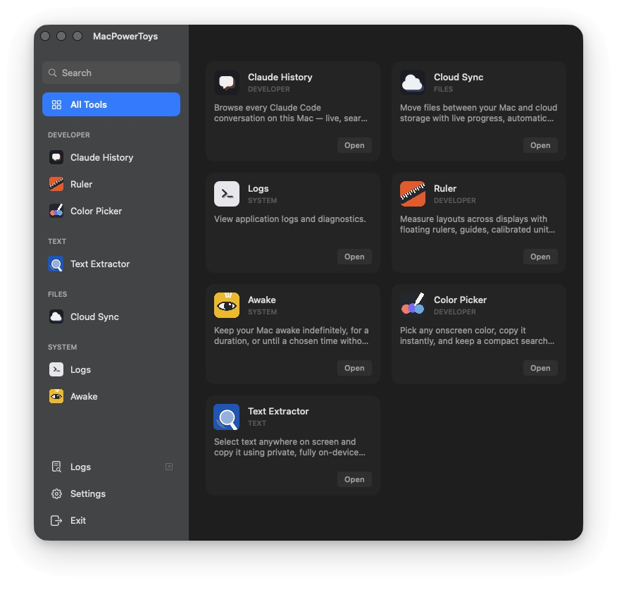
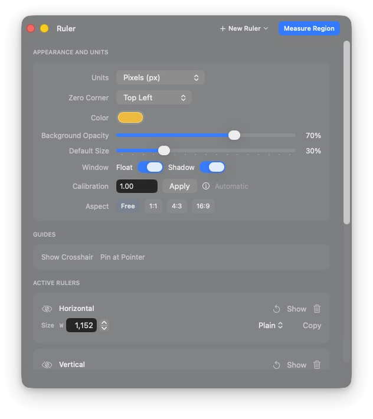
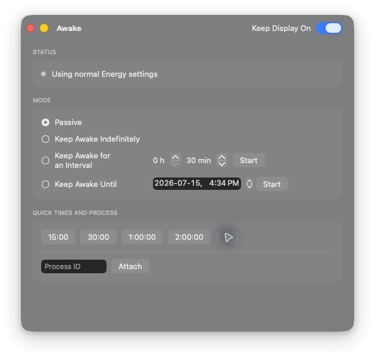
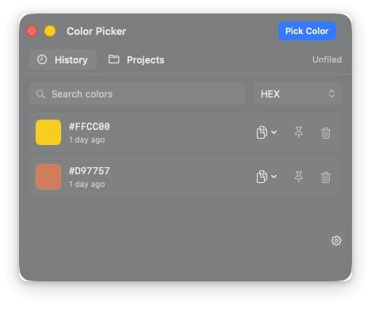
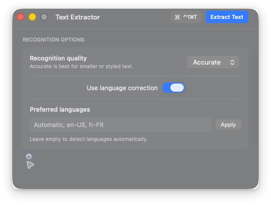

<p align="center">
  
</p>

<h1 align="center">MacPowerToys</h1>

<p align="center">
  A focused collection of fast, native utilities for macOS.
</p>

<p align="center">
  
  
  <a href="LICENSE"></a>
</p>

<p align="center">
  
</p>

MacPowerToys brings seven practical tools into one consistent SwiftUI app. Each utility has its own remembered window, keyboard-first controls, and a dedicated Raycast launcher.

> [!IMPORTANT]
> MacPowerToys is pre-release software. Build it from source and keep backups of important data.

## Included tools

| Tool | Purpose |
|---|---|
| **Ruler** | Measure layouts with horizontal and vertical rulers, guides, calibrated units, and region capture. |
| **Awake** | Keep the Mac or display awake indefinitely, for an interval, until a time, or while a process runs. |
| **Color Picker** | Sample screen colors, copy developer formats, and keep searchable local history. |
| **Text Extractor** | Select a screen region and copy text using Apple's on-device Vision framework. |
| **Cloud Sync** | Plan and run copy, move, mirror, and two-way sync jobs with visible progress and change history. |
| **Claude History** | Search, bookmark, and export local Claude Code conversation history. |
| **Logs** | Search and filter MacPowerToys diagnostics. |

## A closer look

<table>
  <tr>
    <td width="50%" valign="top">
      <br>
      <sub><b>Ruler</b> · calibrated units, guides, and paired rulers</sub>
    </td>
    <td width="50%" valign="top">
      <br>
      <sub><b>Awake</b> · precise time, display, and process controls</sub>
    </td>
  </tr>
  <tr>
    <td width="50%" valign="top">
      <br>
      <sub><b>Color Picker</b> · compact, searchable color history</sub>
    </td>
    <td width="50%" valign="top">
      <br>
      <sub><b>Text Extractor</b> · private on-device recognition</sub>
    </td>
  </tr>
</table>

## Build from source

Requirements: macOS 26.2+, Xcode 26.2+, and [rclone](https://rclone.org/install/) for Cloud Sync. Raycast is optional.

```bash
brew install rclone
git clone https://github.com/surajmandalcell/powertoys.git
cd powertoys
make build
```

Open `powertoys.xcodeproj` to run the `powertoys` scheme in Xcode. On a Mac without an Apple Development identity, use an explicit ad-hoc build:

```bash
make build ADHOC=1
```

Personal-team signing is suitable for the signing Mac. Public distribution requires a paid Apple Developer membership, Developer ID signing, and notarization.

## Cloud Sync, powered by rclone

Cloud Sync is a native interface around the excellent open-source [rclone](https://rclone.org/) project. Provider credentials and remote configuration remain under rclone's control.

MacPowerToys dry-runs each transfer before copying, preserves completed-file progress across relaunches, and records the latest 100 local changes per transfer. **Recalculate** only raises the original plan when new remaining work is found; it never discards completed progress or silently lowers the total.

Do not replace a running installation while a transfer is active. Pause or finish the transfer first.

## Privacy and security

- Text recognition runs locally with Apple Vision; MacPowerToys does not upload selected screenshots.
- Histories, logs, settings, transfer state, and window geometry stay in local Application Support storage.
- Cloud credentials stay in rclone's local configuration. The loopback control API receives a fresh random credential on every launch.
- Marketplace apps must match their declared checksum, bundle identifier, Developer ID team, and Apple notarization before installation.

Read the full [Privacy Policy](PRIVACY.md) and [Security Policy](SECURITY.md).

## Raycast

The companion extension exposes only MacPowerToys and its seven utilities, without cluttering Raycast with internal actions.

```bash
cd raycast
npm ci
npm run build
```

Import the `raycast` directory through Raycast's **Import Extension** command. Launchers use the `macpowertoys://` URL scheme.

## Project layout

```text
powertoys/        SwiftUI app, models, services, and assets
powertoysTests/   Unit and local integration tests
powertoysUITests/ UI smoke tests
raycast/          Optional Raycast launchers
docs/             Product assets and archived specifications
```

See [CONTRIBUTING.md](CONTRIBUTING.md) before opening a pull request. MacPowerToys is available under the [MIT License](LICENSE).
