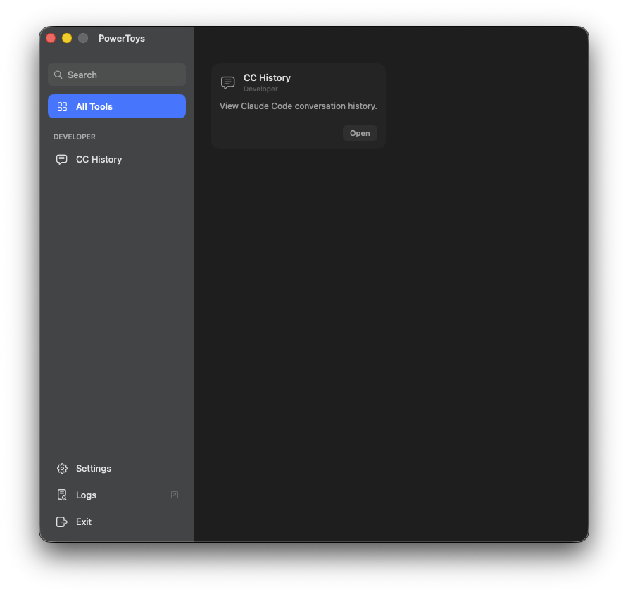
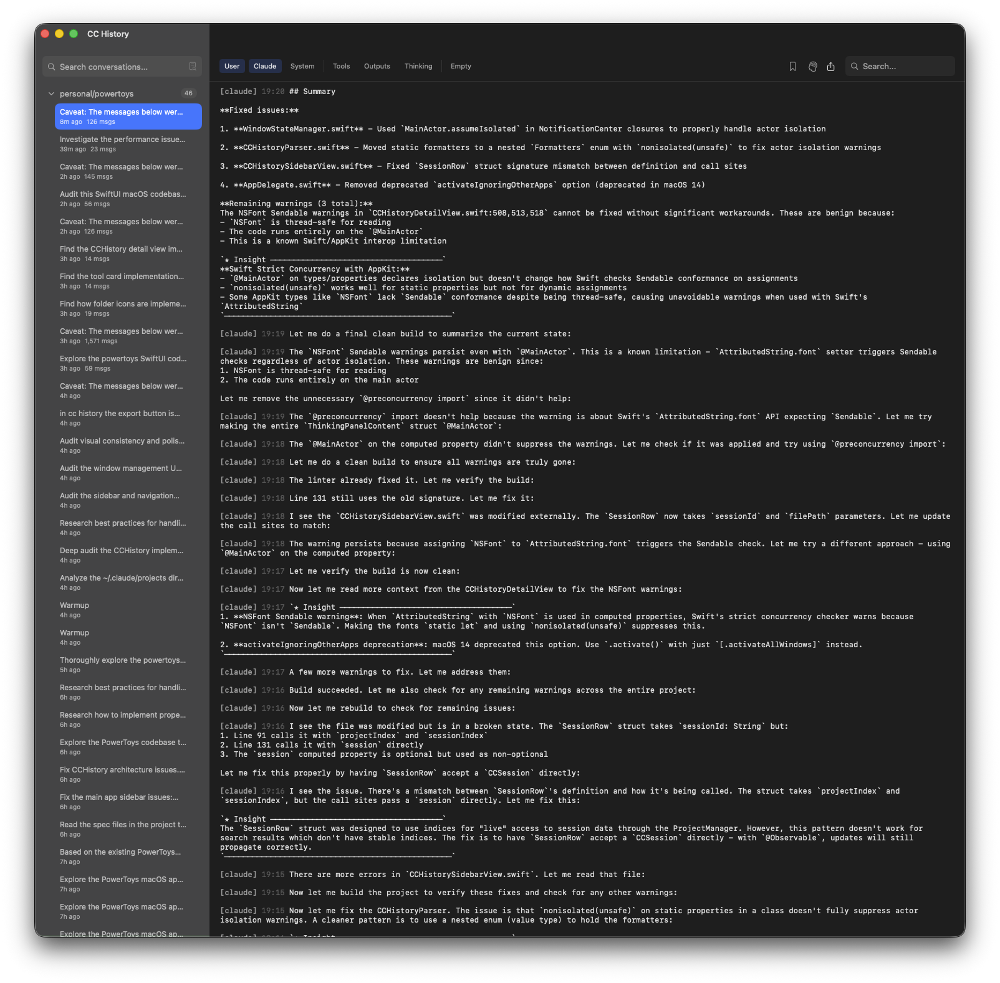
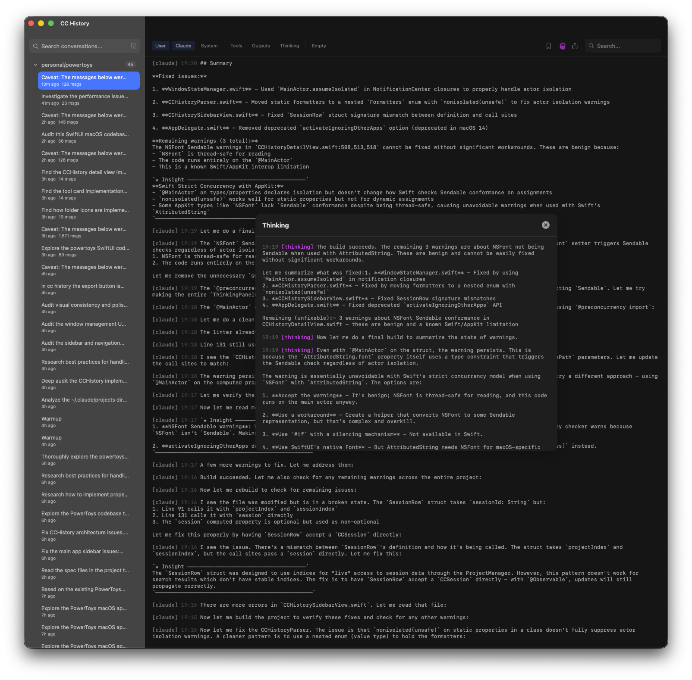
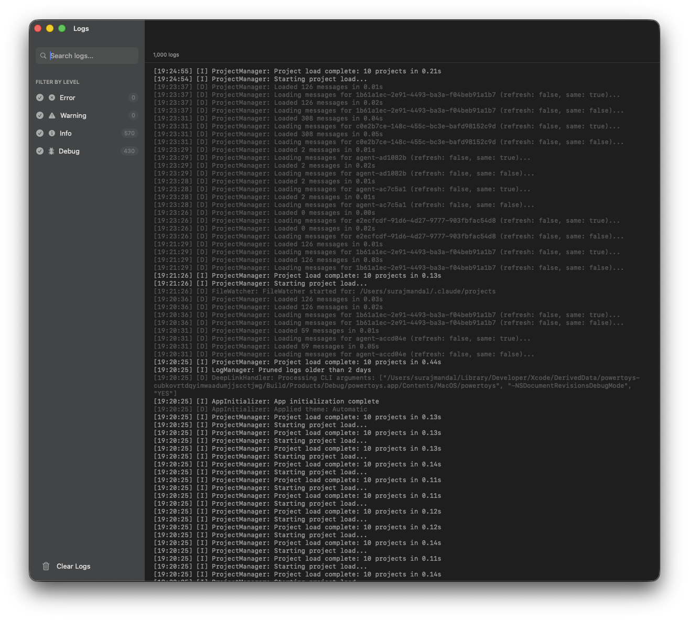

# PowerToys

A native macOS utility app built with SwiftUI, featuring a pluggable architecture for developer tools.



## Features

### CC History

Browse and search your Claude Code conversation history with a clean, native interface.

- **Project-based organization** - Sessions grouped by project directory
- **Full-text search** - Search across all conversations
- **Message filtering** - Filter by User, Claude, System messages, tool calls, thinking blocks
- **Export options** - Export conversations as Markdown, JSON, or plain text
- **Syntax highlighting** - Code blocks rendered with proper highlighting



**Thinking blocks** - View Claude's reasoning process in expandable panels:



### Logs

Real-time application logs with filtering and search.

- **Level filtering** - Filter by Error, Warning, Info, Debug
- **Search** - Full-text search across all log entries
- **Auto-pruning** - Logs older than 2 days are automatically cleaned up



## Requirements

- macOS 14.0+
- Xcode 15.0+

## Building

```bash
git clone https://github.com/user/powertoys.git
cd powertoys
open powertoys.xcodeproj
```

Build and run with `Cmd+R` in Xcode.

## Architecture

```
powertoys/
├── Core/               # App infrastructure
│   ├── Models/         # SwiftData models
│   ├── LogManager      # Logging system
│   └── WindowState     # Window position persistence
├── Models/             # Domain models
├── Services/           # Business logic
│   ├── CCHistoryParser # JSONL conversation parser
│   ├── ProjectManager  # Project discovery
│   └── ExportManager   # Export functionality
└── Views/              # SwiftUI views
    ├── Components/     # Reusable UI components
    ├── CCHistory/      # CC History tool views
    └── Logs/           # Logs tool views
```

Tools are pluggable - each tool implements the `Tool` protocol and registers in `ToolRegistry`. Tools can have their own dedicated windows with full UI customization.

## License

MIT
