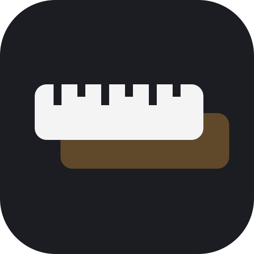
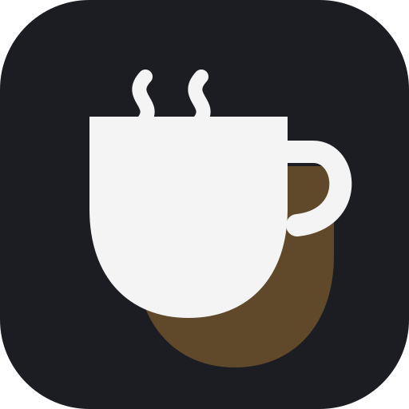
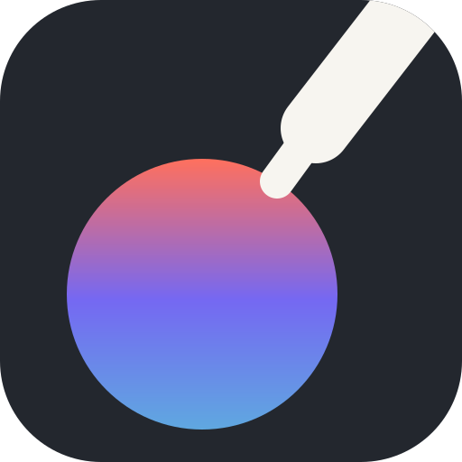
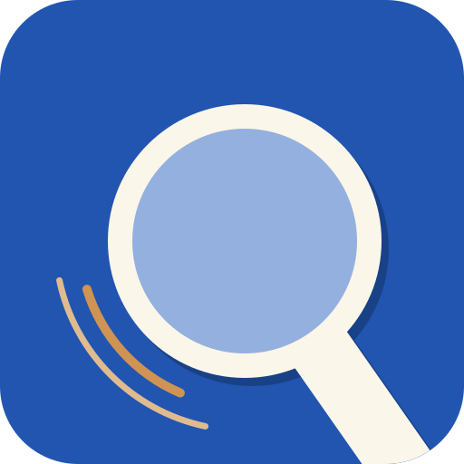
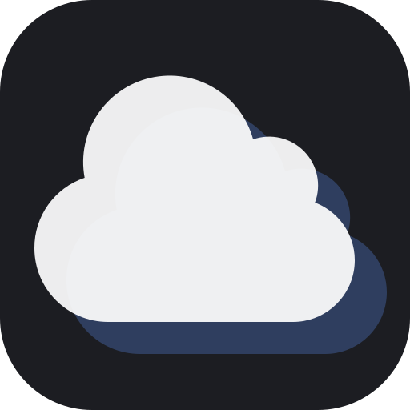
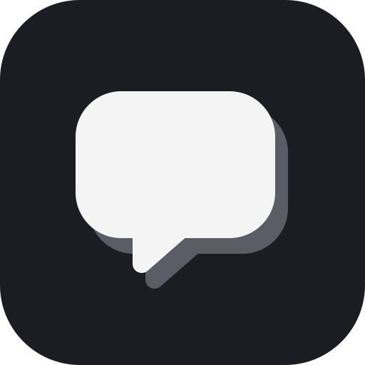
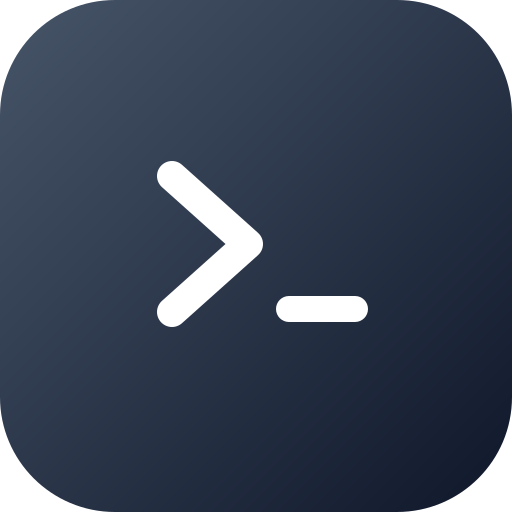
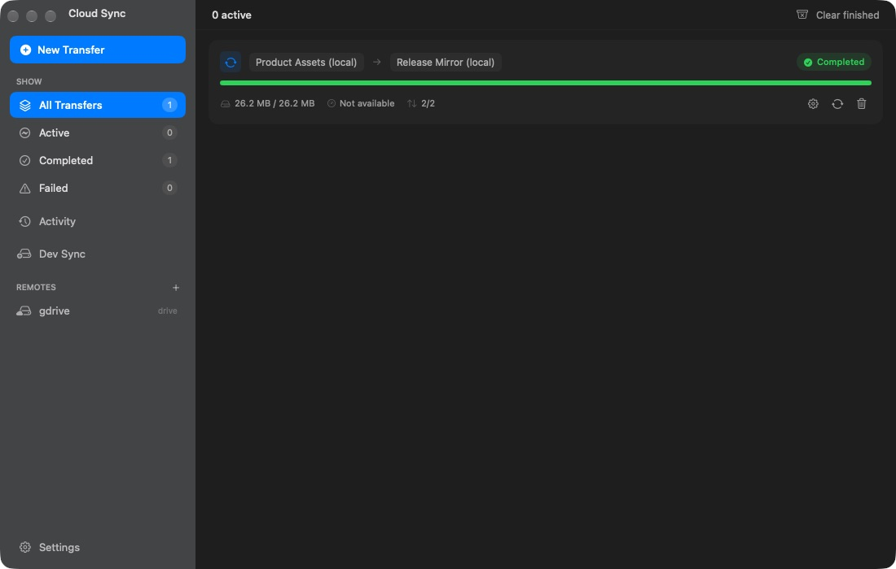

<p align="center">
  
</p>

<h1 align="center">MacPowerToys</h1>

<p align="center">
  <strong>Small macOS utilities. One native home.</strong><br>
  Measure, capture, stay awake, search history, and move files<br>
  without a pile of unrelated menu bar apps.
</p>

<p align="center">
  <a href="https://github.com/surajmandalcell/macpowertoys/releases/latest"></a>
  
  
  <a href="LICENSE"></a>
</p>

<p align="center">
  <a href="https://github.com/surajmandalcell/macpowertoys/releases/latest"><b>Download for macOS</b></a>
  &nbsp;&nbsp;·&nbsp;&nbsp;
  <a href="#build-from-source">Build from source</a>
</p>

<p align="center">
  
</p>

<table>
  <tr>
    <td width="33%" align="center"><b>Native</b><br><sub>SwiftUI, AppKit, system materials, and proper Mac windows.</sub></td>
    <td width="33%" align="center"><b>Private</b><br><sub>Recognition, history, settings, and diagnostics stay local.</sub></td>
    <td width="33%" align="center"><b>Consistent</b><br><sub>One launcher, remembered windows, and keyboard-first controls.</sub></td>
  </tr>
</table>

## Seven focused tools

| | Tool | What it does |
|:--:|---|---|
|  | **Ruler** | Measure the screen with movable, resizable rulers in pixels, millimeters, or inches. |
|  | **Awake** | Keep the Mac or display awake by duration, end time, or running process. |
|  | **Color Picker** | Sample the screen, copy developer formats, and search local color history. |
|  | **Text Extractor** | Select any screen region and copy text with on-device Apple Vision. |
|  | **Cloud Sync** | Plan and run copy, move, mirror, and two-way rclone transfers. |
|  | **AI History** | Search, bookmark, and export local Claude Code conversations. |
|  | **Logs** | Search and filter MacPowerToys diagnostics. |

## Designed for the Mac

<p align="center">
  <br>
  <sub><b>Cloud Sync</b> · planned rclone transfers, persistent progress, and clear completion state</sub>
</p>

<table>
  <tr>
    <td width="50%" valign="top">
      <br>
      <sub><b>Ruler</b> · multiple rulers, precise units, grouping, and per-ruler settings</sub>
    </td>
    <td width="50%" valign="top">
      <br>
      <sub><b>Awake</b> · precise display, time, and process controls</sub>
    </td>
  </tr>
  <tr>
    <td width="50%" valign="top">
      <br>
      <sub><b>Color Picker</b> · compact, searchable color history</sub>
    </td>
    <td width="50%" valign="top">
      <br>
      <sub><b>Text Extractor</b> · fast, private text recognition</sub>
    </td>
  </tr>
</table>

## Build from source

You need macOS 26.2+, Xcode 26.2+, and
[rclone](https://rclone.org/install/) for Cloud Sync.

```bash
brew install rclone
git clone https://github.com/surajmandalcell/macpowertoys.git
cd macpowertoys
make build
```

Open `powertoys.xcodeproj` and run the `powertoys` scheme, or
use `make build ADHOC=1` on a Mac without an Apple Development
identity. Raycast users can import the `raycast` directory;
the extension exposes only the main app and its seven tools.

> [!NOTE]
> Personal-team signing works on the signing Mac. Public,
> warning-free distribution requires Developer ID signing and
> Apple notarization.

## Cloud Sync is powered by rclone

MacPowerToys gives the excellent open-source
[rclone](https://rclone.org/) project a native Mac interface.
Provider credentials and remote configuration remain under
rclone's control.

Every transfer is dry-run planned before data moves. Completed
progress survives relaunches, **Recalculate** only adds newly
discovered work, and each transfer keeps its latest 100 local
changes. Never replace a running installation during a transfer.

## Privacy and security

- Text recognition runs locally with Apple Vision.
- Histories, logs, settings, and window positions stay local.
- Cloud credentials remain in rclone's local configuration.
- The rclone control API uses a fresh random credential per launch.
- Marketplace apps require a declared checksum, Developer ID,
  bundle identity, and Apple notarization.

Read the [Privacy Policy](PRIVACY.md),
[Security Policy](SECURITY.md), and
[Contributing Guide](CONTRIBUTING.md).

<p align="center">
  Made for macOS · Released under the <a href="LICENSE">MIT License</a>
</p>
