<p align="center">
  
</p>

<h1 align="center">MacPowerToys</h1>

<p align="center">
  Fourteen small Mac utilities in one native, dark app.<br>
  Measure, pick colors, read text from the screen, watch your Mac, clean storage, and sync files.
</p>

<p align="center">
  <a href="https://github.com/surajmandalcell/macpowertoys/releases/latest">Download for macOS</a> · Apple Silicon · macOS 26.2+ · MIT
</p>

<p align="center">
  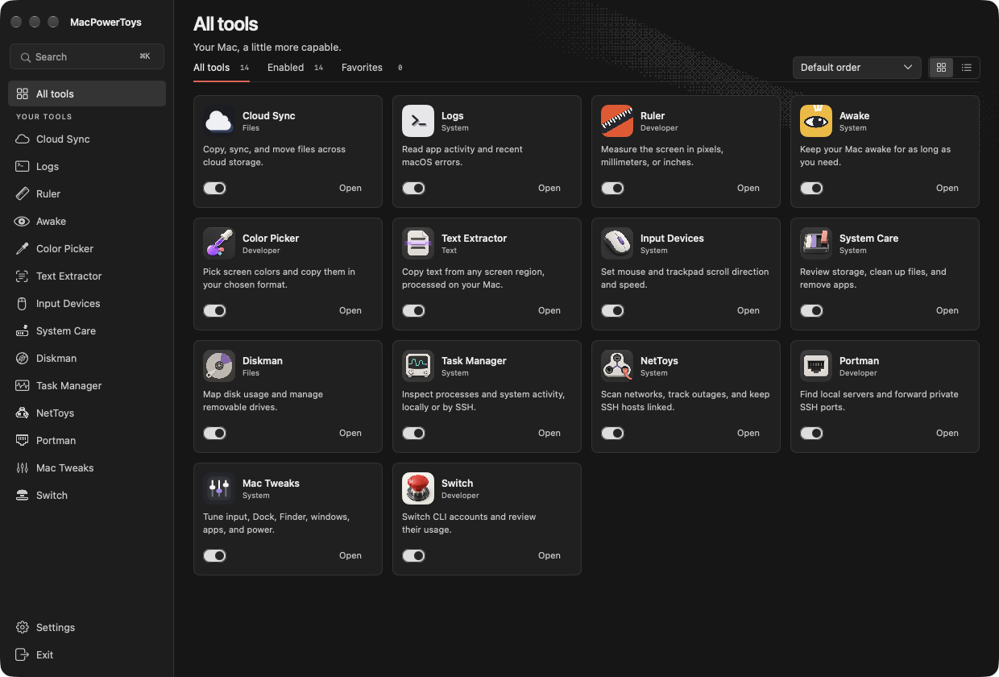
</p>

<p align="center">
  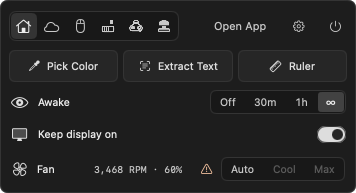
  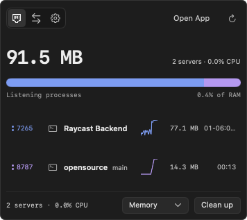
</p>

## What it does

| | Tool | What it does |
|:--:|---|---|
| 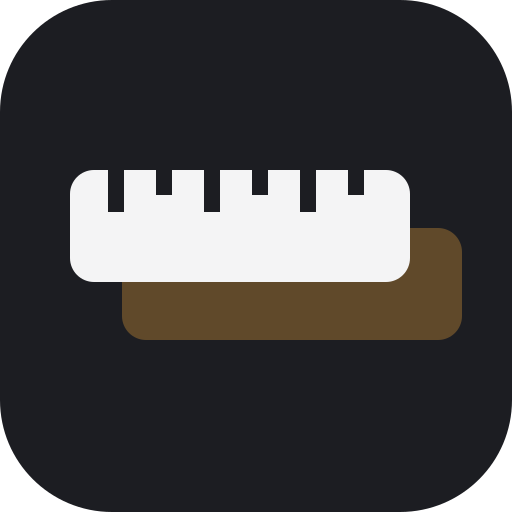 | **Ruler** | Measure the screen with movable rulers in pixels, millimeters, or inches. |
| 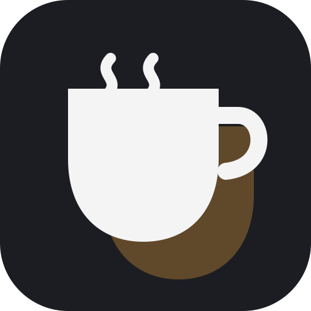 | **Awake** | Keep the Mac or display awake for a duration, until a time, or while a process runs. |
| 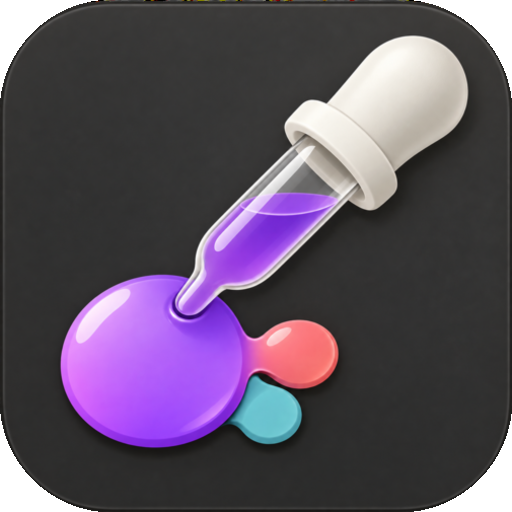 | **Color Picker** | Sample any pixel, copy it in nine formats, and keep colors in projects. |
| 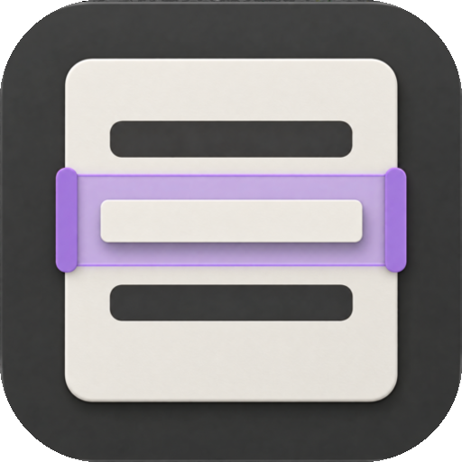 | **Text Extractor** | Select a screen region and copy its text. Apple Vision runs on the Mac. |
| 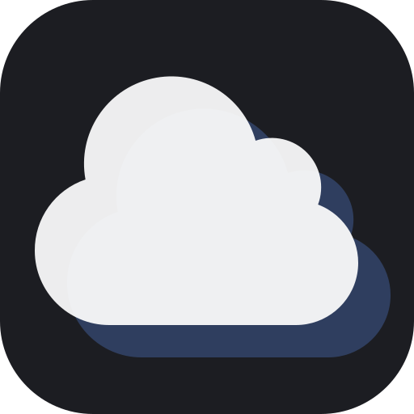 | **Cloud Sync** | Plan and run copy, move, mirror, and two-way rclone transfers. |
| 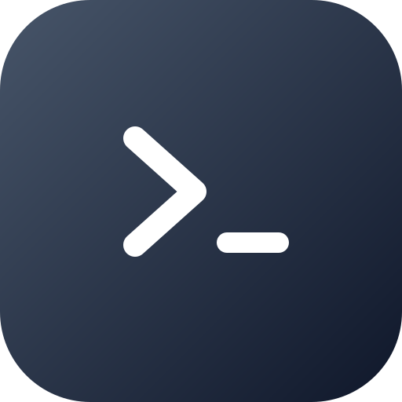 | **Logs** | Read app activity and recent macOS errors. |
| 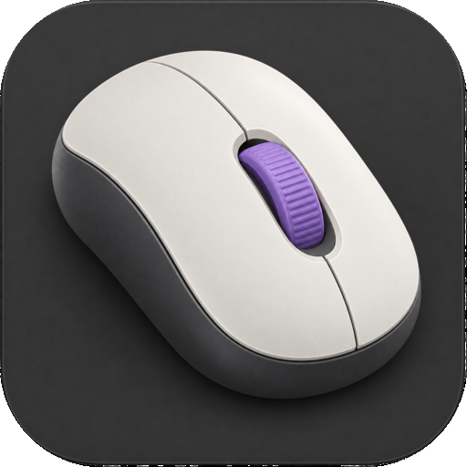 | **Input Devices** | Set scroll direction, speed, and smoothing separately for mouse and trackpad. |
| 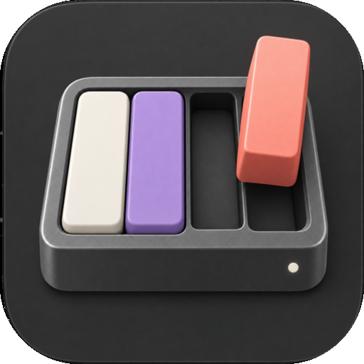 | **System Care** | Review storage, preview cleanup, move items to Trash, and remove apps. |
| 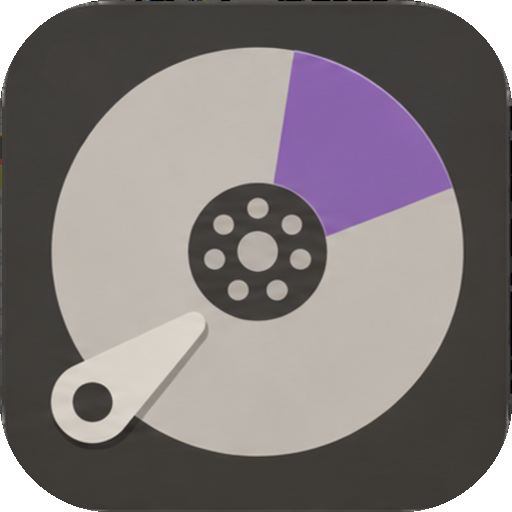 | **Diskman** | Map disk usage as a treemap or rings, and manage removable drives. |
| 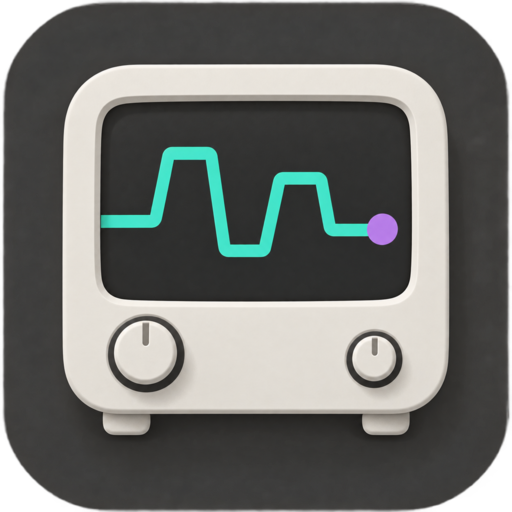 | **Task Manager** | Inspect processes and live activity on this Mac or on hosts over SSH. Optional fan control. |
|  | **NetToys** | Scan networks, track outages, and keep SSH hosts linked when their address changes. |
| 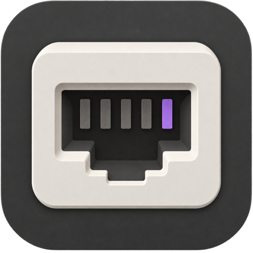 | **Portman** | Find local dev servers and forward ports from a private SSH server. |
| 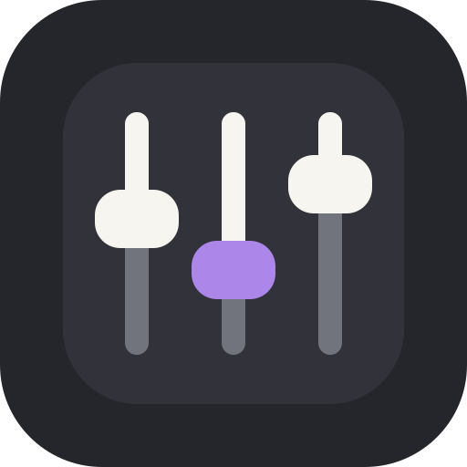 | **Mac Tweaks** | Change hidden Dock, Finder, window, and input settings. Every original value is kept. |
| 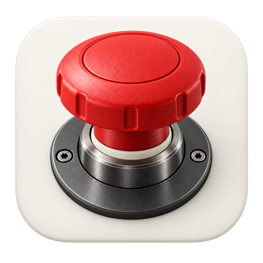 | **Switch** | Switch Codex and Grok CLI accounts and review their usage. |

Each tool opens in its own window and does no work while it is closed.
Turn tools on or off from the launcher. Tools with menu bar content can
appear in the shared popup, as their own menu bar item, or not at all.

<p align="center">
  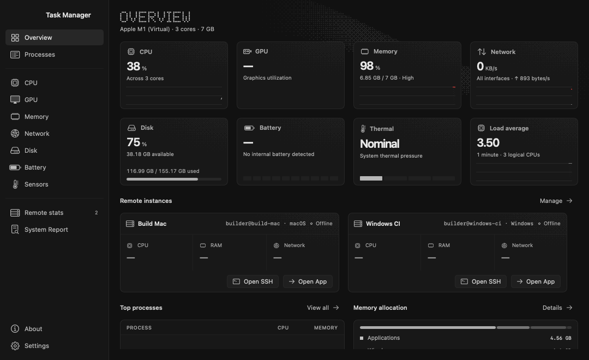
  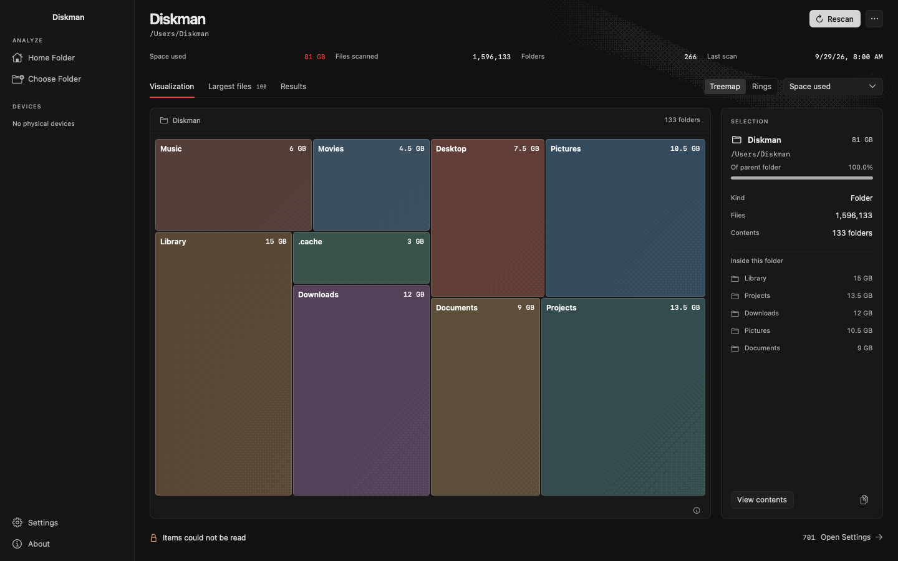
</p>

## Setup

1. Download the latest release, move **MacPowerToys** to Applications, and open it.
2. The build is signed with a personal Apple Development identity and is not
   notarized. If macOS blocks the first launch, open **System Settings →
   Privacy & Security** and choose **Open Anyway**.
3. Turn on the tools you want in the launcher.
4. Grant access only when a tool asks: Screen Recording for Text Extractor,
   Accessibility for Input Devices and the Pick Color shortcut, and Local
   Network and Location for NetToys. Each tool shows its access state and a button
   that opens the right privacy pane.
5. For Cloud Sync, install [rclone](https://rclone.org/install/) with
   `brew install rclone`.

Task Manager fan control and NetToys MAC addresses use signed helpers. macOS
asks you to approve them once in **Login Items**.

## Keyboard

| Shortcut | Action |
| --- | --- |
| Command-Shift-3 | Pick a color (works in any app) |
| Command-Shift-2 | Extract text from a screen region (works in any app) |
| Option-Command-P | Open Portman (works in any app) |
| Command-1 to Command-9 | Open launcher pages: All tools, then the first eight tools |
| Command-O | Open the selected tool |
| Command-F | Search in the current window |
| Command-comma | Open settings for the current window |
| Command-W | Close the window; the app keeps running in the menu bar |
| Option-Command-Q | Quit MacPowerToys |

Change or turn off the global shortcuts in each tool's settings.

## Limits

- Releases are signed for personal use, not notarized. Developer ID signing
  and notarization are still open.
- Cloud Sync cannot reorder files inside a running directory transfer. A paused
  file can restart; finished files stay complete.
- Google Drive setup needs your own OAuth client ID.
- Input Devices separates mouse and trackpad by event type. macOS does not give
  each scroll event a device identity.
- NetToys scanning and SSH Anchor support IPv4 only.
- System Care moves items to Trash. Use **Put Back** in Finder before you empty it.
- macOS restores a window's position and display, but not its Space.

## Privacy

MacPowerToys has no analytics, ads, or telemetry. Text recognition runs on the
Mac. rclone keeps provider credentials in its own configuration. Optional
iCloud settings sync uses an allowlist and never syncs credentials, paths,
histories, or logs. Read the [Privacy Policy](PRIVACY.md) and
[Security Policy](SECURITY.md).

## Related projects

- [Switch](https://github.com/surajmandalcell/switch): the standalone Switch app and terminal tool. MacPowerToys uses its shared Core package.
- [NetToys](https://github.com/surajmandalcell/nettoys): NetToys as its own app. MacPowerToys embeds the same package.
- [OnePlusUI](https://github.com/surajmandalcell/oneplus-ui): the SwiftUI component package behind every window and popup.

You can also [build and share your own tool](docs/MARKETPLACE_TOOLS.md) through
a Marketplace catalog.

## Build and tests

```bash
brew install rclone
git clone https://github.com/surajmandalcell/macpowertoys.git
cd macpowertoys
make build          # or: make build ADHOC=1 without an Apple Development identity
```

[Development guide](docs/DEVELOPMENT.md) · [Contributing](CONTRIBUTING.md) · [Changelog](CHANGELOG.md)

## Credits

Ruler includes [Free Ruler](https://github.com/pascalpp/FreeRuler) by Pascal
Balthrop (MIT, [license](powertoys/FreeRuler/FreeRuler-LICENSE.txt)). The fan
reader adapts code from [smctl](https://github.com/leaperone/smctl) (MIT,
[license](powertoys/Core/smctl-LICENSE.txt)). Cloud Sync is a native interface
for [rclone](https://rclone.org/). The menu bar glyph is adapted from
[Lucide](https://lucide.dev) (ISC).
